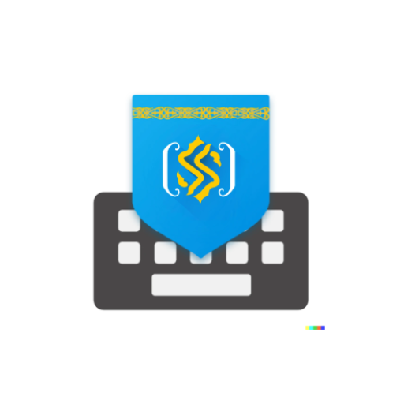

# SmartKeyboard

**SmartKeyboard** is a free and open-source keyboard for Android 7.0+
devices. It aims at being modern, user-friendly and customizable while
fully respecting your privacy. This is a fork from [FlorisBoard project](https://github.com/florisboard/florisboard).
Many thanks to Patrick Goldinger for implementing such a beautiful keyboard!

## Highlighted features
- Integrated clipboard manager / history
- Advanced theming support and customization
- Integrated extension support (still evolving)
- Emoji keyboard
- Spell checking service
- Glide typing (currently English only)
- Word suggestion in Kazakh and English

## Contributing
Wanna contribute to SmartKeyboard? That's great to hear! There are lots of
different ways to help out. Bug reporting, making pull requests,
translating SmartKeyboard to make it more accessible, etc. For more
information see the [contributing guidelines](CONTRIBUTING.md). Thank
you for your help!

## List of permissions SmartKeyboard requests
Please refer to this [page](https://github.com/BMukhtar/smartkeyboard)
to get more information on this topic.

## Used libraries, components and icons
* [AndroidX libraries](https://github.com/androidx/androidx) by
  [Android Jetpack](https://github.com/androidx)
* [Accompanist Compose UI libraries](https://github.com/google/accompanist/) by
  [Google](https://github.com/google)
* [AboutLibraries](https://github.com/mikepenz/AboutLibraries) by
  [mikepenz](https://github.com/mikepenz)
* [Google Material icons](https://github.com/google/material-design-icons) by
  [Google](https://github.com/google)
* [JetPref preference library](https://github.com/patrickgold/jetpref) by
  [patrickgold](https://github.com/patrickgold)
* [KotlinX coroutines library](https://github.com/Kotlin/kotlinx.coroutines) by
  [Kotlin](https://github.com/Kotlin)
* [KotlinX serialization library](https://github.com/Kotlin/kotlinx.serialization) by
  [Kotlin](https://github.com/Kotlin)
* [ICU4C](https://github.com/unicode-org/icu) by
  [The Unicode Consortium](https://github.com/unicode-org)
* [Symspell](https://github.com/BMukhtar/ksymspell) by
  [Symspell](https://github.com/BMukhtar)

Many thanks to [Nikolay Anzarov](https://www.behance.net/nikolayanzarov) ([@BloodRaven0](https://github.com/BloodRaven0)) for designing and providing the main app icons to this project!

## License
```
Copyright 2020-2022 Mukhtar Bimurat

Licensed under the Apache License, Version 2.0 (the "License");
you may not use this file except in compliance with the License.
You may obtain a copy of the License at

http://www.apache.org/licenses/LICENSE-2.0

Unless required by applicable law or agreed to in writing, software
distributed under the License is distributed on an "AS IS" BASIS,
WITHOUT WARRANTIES OR CONDITIONS OF ANY KIND, either express or implied.
See the License for the specific language governing permissions and
limitations under the License.
```
